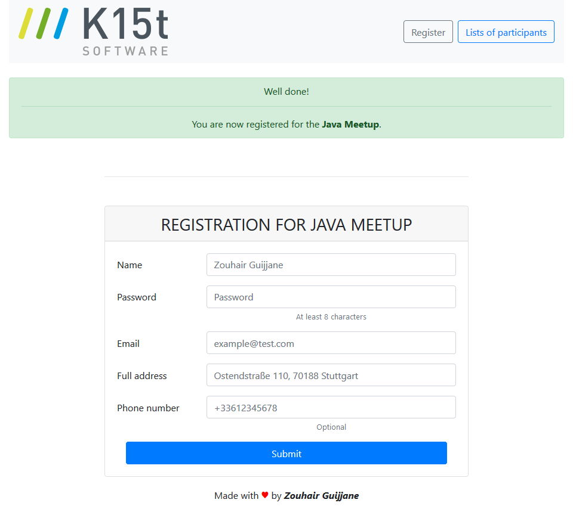
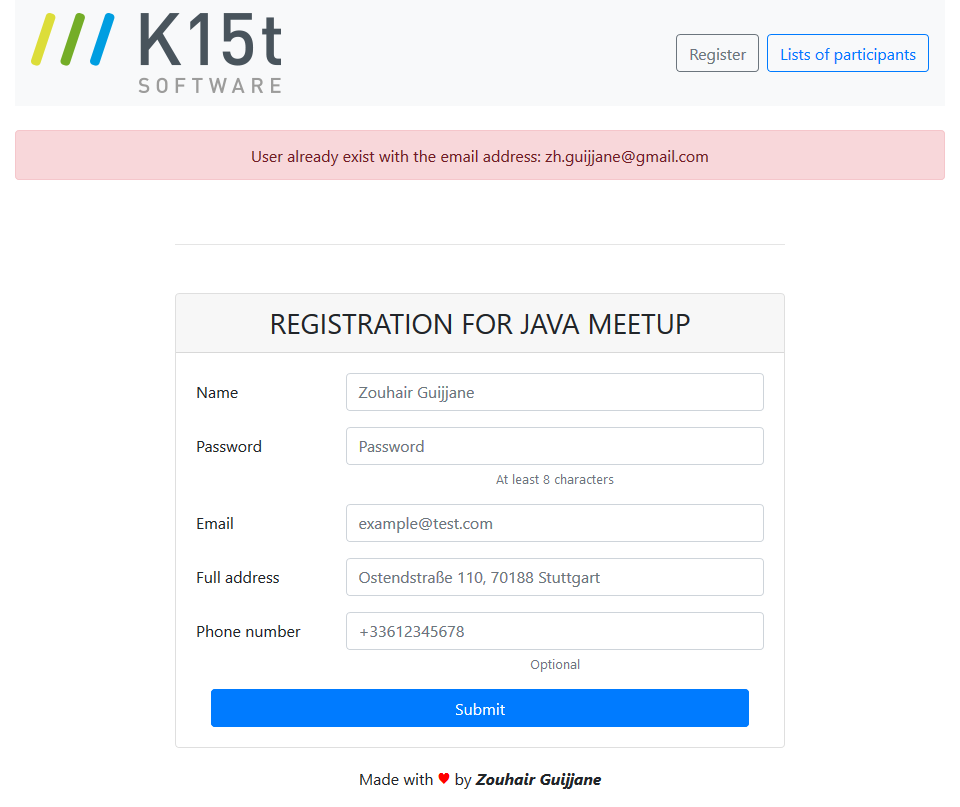
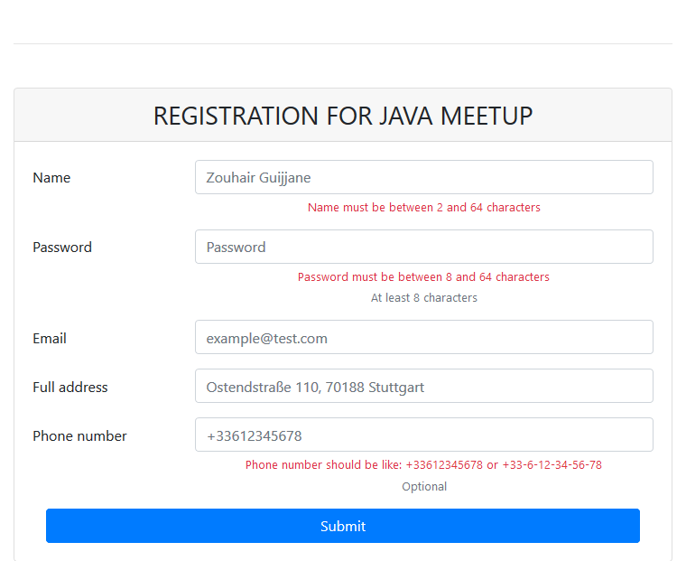
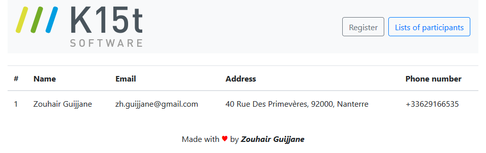
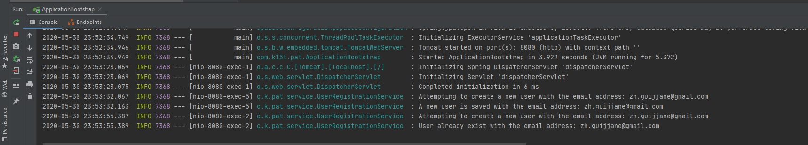
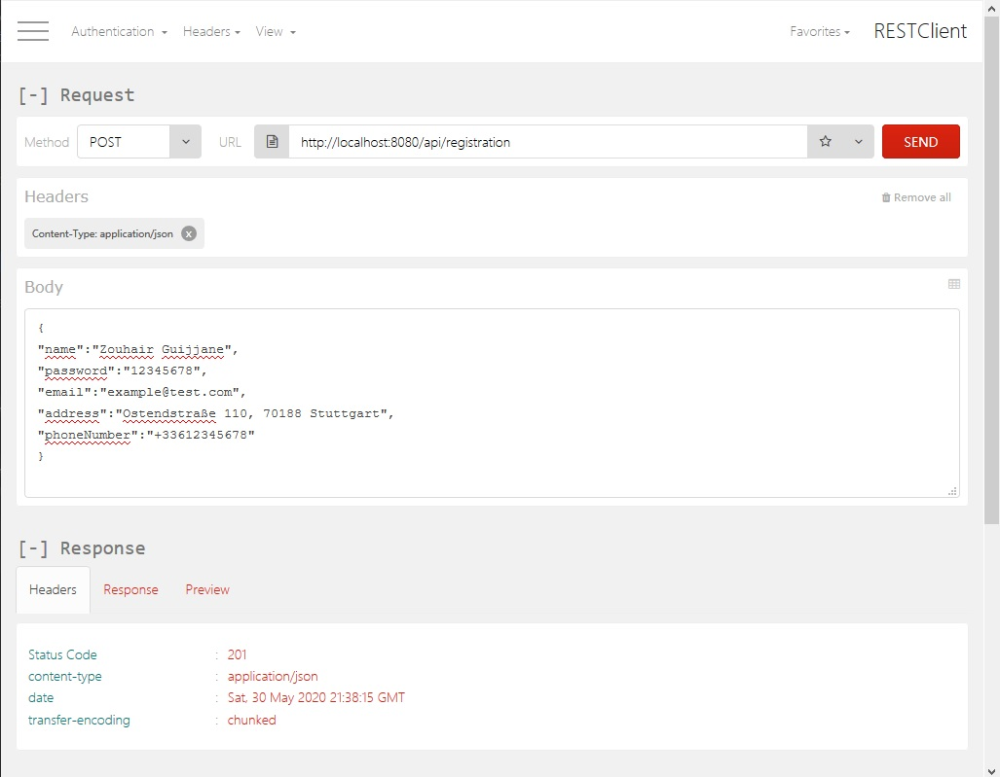
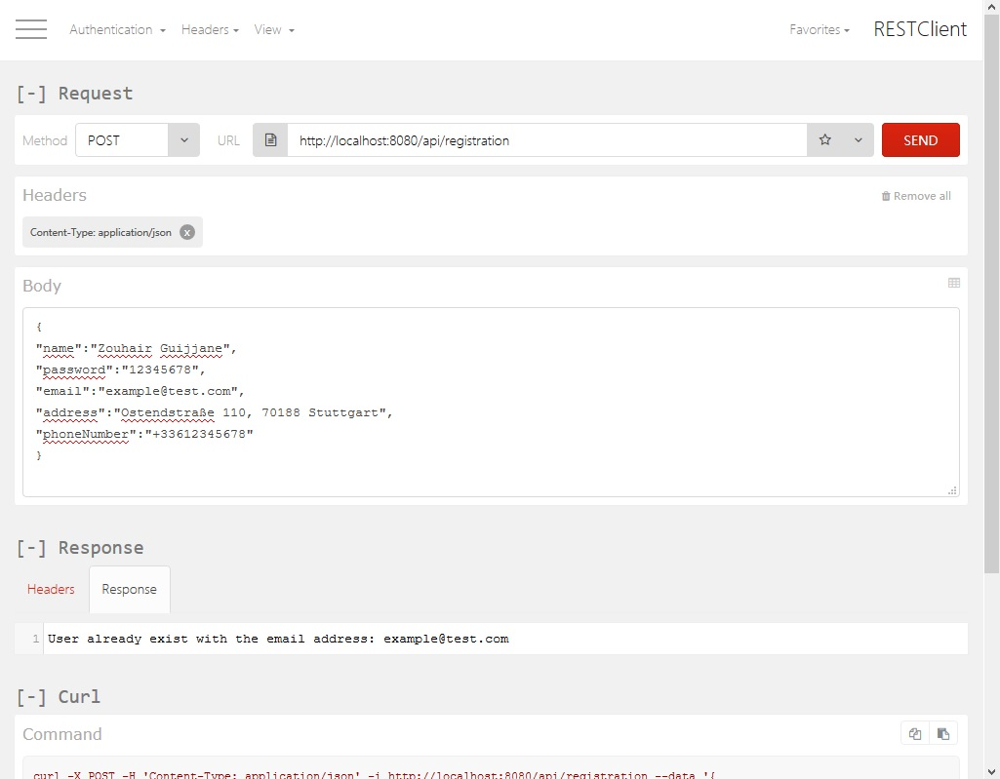

# Full-Stack Developer Sample Project


## What is it about?
Here we have a small web application allowing to register for the next Java Meetup.
Unfortunately the most important part of the app is still missing. The form 
fields as well as the backend to store the data in memory. But you are here to 
help us out and get it done.
 
## But *what* should I do exactly?
Extend the form with the required fields (see registration.vm for further details) and 
store the entered information by using a REST endpoint. Giv the user feedback if the
save was successful or in case of an error. Ensure mandatory fields will be entered
and verify the entered values are reasonable e.g. the name must not contains numbers.

To start with, please see the already created files and classes. Especially:

* com.k15t.pat.registration: The package includes a REST endpoint and a controller
* resources/templates: The folder includes the initial velocity templates for the registration page 

The Maven build creates a executable jar which includes the whole runtime (tomcat) to run the app.
You can start it with java -jar registration-0.1.0.jar. If the application is started the pages are
available under http://localhost:8080/registration.html

## A few words about the technology stack
The application is build on top of Spring Boot (http://projects.spring.io/spring-boot/) providing a runtime container. 
Furthermore Jersey for implementing REST resources, Velocity for templating pages and jQuery/Bootstrap is included and 
can be used as well. Building and packaging the application is done with Maven. 

## What's expected of me?
When our engineers receive your final result, we'll be looking at the following things:

* The documentation provided. Please consider to document assumptions or decisions you made (e.g. technologies used). Clear and concise documentation is a must for a senior role. The documentation should start in the README.md, which can then contain links/pointers into any further documentation.
* The ability to build it out of the box using maven
* Improvements you made around the main task
* The quality and style of code written
* The tests and their structure and coverage
* The choice of technologies used to complete the task. You are free to use whatever you think is needed and helps you to get it done!

Typically we expect it to compile and run on a Mac environment with Java 8. If your set up is any different, do let us know!
When you are done share the result via GitHub or Bitbucket.

## How to use git ##

To use git to get repository contents run the following git command:

```bash
$ git clone https://bitbucket.org/K15t/k15t-full-stack-dev-tasks.git
```

Afterwards create a repository in your github or Bitbucket account and configure this empty repository as the remote origin:

```bash
$ git remote set-url origin git@github.com:you/yourrepo.git
$ git push
```
In this way you have now a clean repository and can start to commit to it and we will be able to distinguish between what was your contribution and what was already there. Please do not copy everything into an empty repo and then add all files, this will make the git log and diff a mess.

Tip: Use git as you would in a product environment - small, meaningful commits with descriptive commit messages. This makes it easy for the reviewer to follow your steps and comprehend what you are doing.

Good luck!

# Solution
### Prerequisites:
- Install Java 8+ installed [here](https://www.oracle.com/java/technologies/javase-downloads.html)
- Install Maven 2+ installed [here](https://maven.apache.org/install.html)
- Postman [here](https://www.getpostman.com/downloads/) or as plugin for [Firefox](https://addons.mozilla.org/fr/firefox/addon/restclient/)

### Implementation
##### Dependencies added
* Lombok : A Java library used to minimize boilerplate code.
* JUnit 4 : A Framework for unit testing Java applications.
* H2 Database : An in-memory database.
* AssertJ : A fluent assertion library.

I changed Velocity with Thymeleaf since it's outdated.
The best practices for server-side rendering have shifted towards using a template engine. These get the responsibility to merge the data with the template into the actual output.
Current preference appear to be:
- Thymeleaf
- FreeMarker

JSP's and JSF are entirely different things have become out of fashion.

Jersey with Velocity and Bean validations was a bit of a pain. 
I ended-up with Spring MVC as Jersey requires a hell of configuration to make it work with Spring Boot.
 
### Running
- To build the project, in the folder containing pom.xml, run the command:
    - ```$ mvn package``` This command will create a JAR in the target folder

The command below will run the client:
```
$ java -jar target/k15t-full-stack-dev-tasks-0.1.0.jar
```

The application will start on port 8080: http://localhost:8080

#### The interface
 

- Banner telling the participant is registered for the meetup.



- In case of already existing email.



- Error labels in red are showing if any errors detected



- Click on the right top button '*List of participants*', and you shall see all the participants for the meetup:



- Logs on the server side 



##### Send POST Call via Postman
- Use the API http://localhost:8080/api/registration in the Postman endpoint bar. Make sure that POST is selected in the Method type drop down.
- Set the header application as : 
    - **Name:** Content-Type
    - **Attribute value:** application/json
- This endpoint expects a JSON body which contains the details of the user. 
- Copy and Paste the following in the body tab of Postman.

```json
{
"name":"Zouhair Guijjane",
"password":"12345678",
"email":"example@test.com",
"address":"Ostendstraße 110, 70188 Stuttgart",
"phoneNumber":"+33612345678"
}
```
- Press Send and then see the Response Status


- In case of conflict (User already exists)



### Improvements

- Avoid links for JQuery and Bootstrap, instead download them on local.
- Add a Creation Date column for every user.
- Run application with Docker-compose.
- Cancel participants from attending the meetup for admins.
- Hash the password using Spring Security (BCryptPasswordEncoder will generate the salt for us internally)
- Add End-To-End tests
- Add CI/CD
- Run JaCoCo code coverage and fail the build if desired percentage is not met
- Run SonarQube code quality checks
- Build Docker image and publish it to Docker Hub
- Deploy application on some free cloud hosting service like Heroku or OpenShift
